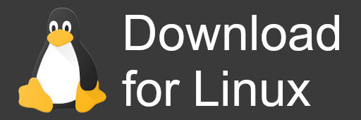
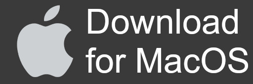

<h1 align="center">
  <br>
	Practice like a boss
</h1>

## 🚧 Release note and project reset

### Important
This repository has been completely reset for legal reasons:
- All commits have been cleaned up and rewritten.
- There is no trace of old challenge records left in the history.

### What has changed
- History rewritten to zero
  - Each commit has been purged of all references to old challenges.
  - The history now contains only authorised code.
- Branches and tags
  - Only the main branch remains
  - All other branches have been deleted.

### What's next?
The heart of the project was not the challenges but the software itself. You have to see it as a real return to the source, and a chance to do something great.

### How do you create challenges?

The general operation remains unchanged:
- Clone the repository:
```shell
git clone https://github.com/c-bertran/codeshell.git
cd codeshell
```
- Follow [the detailed tutorial](#create-or-install-custom-challenge) to generate new challenges from scratch.
- Make a pull request to offer it to everyone!

### Why a fresh start is a good thing
- Lightweight history focused on current content
- No dependency on old content; you start from a fully mastered base
- Simplified governance: one main branch, easier to maintain
- Clear foundations for developing new features

### Thank you for your understanding and support!
If you have any questions or suggestions, please leave a message. Enjoy your use and development!

---

<h1 align="center">CodeShell will allow you to practice coding challenges and improve your programming skills</h1>

   

</img>

## Direct downloads

<div align="center">
	<a href="https://github.com/c-bertran/codeshell/releases/latest/download/codeshell-linux" style="margin-right: 1em">
		
	</a>
	<a href="https://github.com/c-bertran/codeshell/releases/latest/download/codeshell-macos" style="margin-left: 1em">
		
	</a>
</div>

---

- [Challenges](#challenges)
- [How to use](#how-to-use)
	- [Arguments](#arguments)
	- [Dependencies](#dependencies)
- [Config codeshell](#config-codeshell)
- [Create or install custom challenge](#create-or-install-custom-challenge)
	- [Install a custom challenge](#install-a-custom-challenge)
	- [Create a custom challenge](#create-a-custom-challenge)
- [Contributor](#contributor)
- [Disclaimer](#disclaimer)
- [License](#license)

CodeShell provides a comprehensive practice environment for coding challenges:
- Multiple exercises available per level, chosen randomly
- Exponential waiting times for correction simulation
- Git-based submission system for your solutions
- Automated code review checking for forbidden functions and memory leaks
- Trace functionality when exercises allow it
- Program comparison with expected outputs

Some enhanced features have been added:
- Multilingual interface (currently available in `French` and `English`)
- Two special modes:
  - `Infinite`: Disables the timer for unlimited practice time
  - `Doom`: Advanced difficulty mode - if you fail, the entire workspace is reset along with git history

## Challenges
CodeShell is designed to work with custom challenges. After the project reset, no specific challenges are included by default.

You can:
- Create your own challenges using the built-in tools
- Install community-created challenges
- Contribute new challenges to the community

Visit the [Create or install custom challenge](#create-or-install-custom-challenge) section to get started!

## How to use
Launch your favorite command prompt, and simply run the program:
```sh
./codeshell
```

If a rights problem occurs during the execution, make the following command:
```sh
chmod +x codeshell && ./codeshell
```

### Arguments
| Args | Definition |
| --- | --- |
| -C or --custom | Create the folder that can contain the *challenges* created by other people, and also the configuration file |
| -N or --new | Launch the cli to create the boilerplate for a new challenge |

### Dependencies
CodeShell is dependent on several external software. Under Linux, the installation can be done by the software itself at startup. However under MacOS you will have to install them yourself. Here is the list with their versions to help you
| Software | Version |
| --- | --- |
| bash | `>= 4.0` |
| clang | `>= 13.0` |
| git | `>= 2.20` |
| valgrind | `>= 3.10` |

## Config codeshell
You can configure the behavior of codeshell via the `config.json` file in the *challenges* folder.
It has the following options:
```json
{
	"checkUpdate": true,
	"checkLib": true,
	"signature": true,
	"challenge": "my_challenge",
	"lang": "en_US",
	"options": {
		"doom": false,
		"infinite": false,
	}
}
```

- checkUpdate `boolean` : Checks if a new version is available
- checkLib `boolean` : Checks if the necessary libraries are installed
- signature `boolean` : Print the application's logo and signature
- challenge `string` : Id of the challenge
- lang `string` : Selected lang ('en_US', 'fr_FR')
- options.doom `boolean` : All work and git is reset if grademe failed
- options.infinite `boolean` : There is no time limit anymore

## Create or install custom challenge
Starting with version `0.3.0` codeshell allows you to create your own challenges in a simple and concise way.
If you want to share your challenge, don't hesitate to open a issue with the challenge label so that it can be added to a list.

### Install a custom challenge
1. Create a `challenges` directory in the root of the application, or launch `./codeshell -C`
2. Paste custom challenge in this directory
3. Start application, if challenge is correct, it will appear in the selection list

### Create a custom challenge
You can create custom challenges by adding new exercises: [Contributing](CONTRIBUTING.md)

## Contributor
Thanks to you and your help, codeshell is getting better every day. I would like to thank those people who gave their time 🧡

<div align="center">
	<a href="https://github.com/Filoji">
		
	</a>
	<a href="https://github.com/B-ki">
		
	</a>
	<a href="https://github.com/pulgamecanica">
		
	</a>
	<a href="https://github.com/ThatsLucas">
		
	</a>
</div>

## Disclaimer
CodeShell is an independent coding practice tool. All challenges and exercises are community-created and original content.
If you find any issues or have suggestions for improvements, don't hesitate to open an issue.

## License
```text
CodeShell Copyright (C) 2022 - ...  Clément Bertrand
    
This program is free software: you can redistribute it and/or modify
it under the terms of the GNU General Public License as published by
the Free Software Foundation, either version 3 of the License, or
(at your option) any later version.

This program is distributed in the hope that it will be useful,
but WITHOUT ANY WARRANTY; without even the implied warranty of
MERCHANTABILITY or FITNESS FOR A PARTICULAR PURPOSE. See the
GNU General Public License for more details.

You should have received a copy of the GNU General Public License
along with this program. If not, see <https://www.gnu.org/licenses/>.
```
